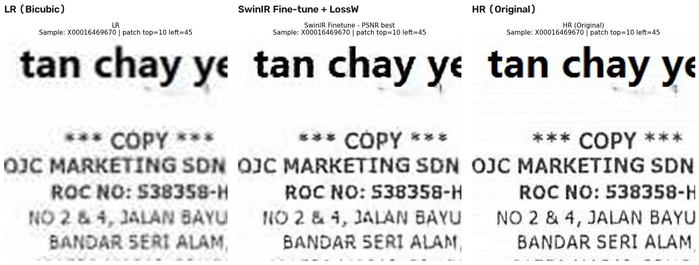
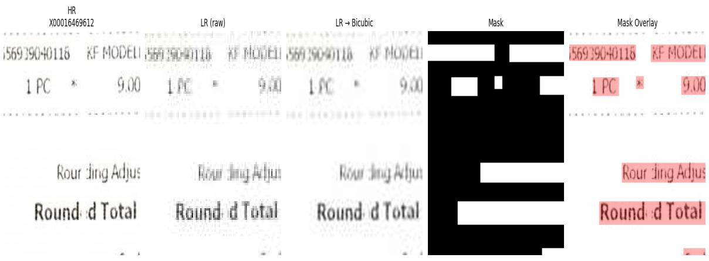

# 저화질 문서 이미지의 텍스트 중심 Super-Resolution

> **🔗 이 모델로 만든 서비스: [또렷 — ddoreot.site](https://ddoreot.site)**
> 텍스트 업스케일링에 특화된 웹 서비스로 배포 중입니다. 이미지를 업로드하면 본 저장소의 fine-tuned SwinIR 모델이 글자를 복원합니다.

저화질 문서 이미지에서 **텍스트 가독성**을 높이는 것을 목표로 한 x2 super-resolution 프로젝트입니다.
이미지 전체 화질이 아니라, 실제 업무에서 중요한 **글자 획·숫자 경계·작은 문자 구조**의 복원에 초점을 맞췄습니다.



## 프로젝트 배경

인턴 근무 당시 클라이언트사로부터 받은 증빙자료 중 일부는 화질이 낮아 담당자 정보·문서번호·금액 등을 식별하기 어려웠고, 매번 자료를 재요청해야 하는 비효율이 있었습니다. 이 문제를 해결하기 위해 문서 이미지의 텍스트 영역을 선명하게 복원하는 SR 모델을 만들어보았습니다.

## 검증 목표

1. **텍스트 영역 가중 학습**(LossW)이 일반 L1 학습보다 효과적인가 — PSNR/SSIM 비교
2. **SwinIR**이 Bicubic·SRCNN 등 비교 모델보다 문서 이미지 SR에 우수한가
3. 복원 결과가 **실제 OCR 인식 성능**(CER/WER) 향상으로 이어지는가

## 데이터셋 & 전처리

- **[SROIE datasetv2](https://www.kaggle.com/datasets/urbikn/sroie-datasetv2/data)** — 영수증 이미지 973장 (train 500 / val 126 / test 347)
- 원본을 HR로 사용, 인위적 열화(x2 downsampling + blur 20%·JPEG 압축 25%·Gaussian noise 10% 확률)로 LR 생성
- box 좌표로 **텍스트 마스크** 생성 (텍스트=1, 배경=0) → 가중 loss 계산에 사용
- 192×192 crop 시 텍스트 비율 0.005 이상 패치 우선 선택 (여백 패치 방지)
- 학습 샘플: 96×96 LR → 192×192 HR + 192×192 text mask



## 모델 & 학습

| 항목 | 내용 |
|---|---|
| 주 모델 | **SwinIR-lightweight (x2)** — Swin Transformer 기반, shifted window로 문맥 반영 |
| 비교 모델 | Bicubic interpolation, SRCNN, Scratch SwinIR, Fine-tuning SwinIR |
| 학습 조건 | Adam (scratch 1e-4 / fine-tune 2e-5), CosineAnnealingLR, batch 32, 50 epochs |
| Loss 조건 | `L1` (전체 균등) vs **`LossW`** (텍스트 가중) |

**LossW (텍스트 영역 가중 손실):**

```
LossW = 2.0  × L1_text
      + 0.05 × L1_background
      + 0.1  × (1 − SSIM_text)
      + 0.02 × (1 − SSIM_global)
```

문서 이미지는 배경 질감보다 글자가 중요하므로, 텍스트 영역 L1에 40배 큰 가중치를 주고 텍스트 SSIM 항을 추가해 획 구조를 우선 학습하도록 설계했습니다.

### Optuna 하이퍼파라미터 탐색

수동으로 정했던 LossW 가중치와 learning rate를 **Optuna**로 자동 탐색해 fine-tuning 성능을 추가로 끌어올렸습니다. Adam은 loss 전체 스케일에 거의 불변이므로 텍스트 L1 가중치는 `a=2.0`으로 고정하고, 나머지 비율과 lr의 4차원만 탐색했습니다.

| 항목 | 내용 |
|---|---|
| 목적함수 | val **SSIM Text** 최대화 |
| 탐색 공간 | lr (5e-6 – 2e-4), b (0.005 – 0.5), c (0.01 – 1.0), d (0.005 – 0.3) — 모두 log scale 샘플링 |
| 탐색 전략 | TPESampler + MedianPruner (가망 없는 trial 조기 중단) + 얼리스탑 (patience 4) |
| 규모 | 20 trials × 최대 15 epoch (5개 trial pruning으로 조기 종료) |
| 최종 학습 | best params로 최대 100 epoch, 얼리스탑 patience 10 |

**Best params (trial 20, 탐색 중 val SSIM Text 0.9464):**

```
LossW_optuna = 2.0    × L1_text
             + 0.0403 × L1_background
             + 0.6458 × (1 − SSIM_text)
             + 0.0076 × (1 − SSIM_global)
lr = 1.94e-4
```

수동 설정 대비 **텍스트 SSIM 항의 가중치(c)가 약 6배 커지고 lr도 10배 커진 조합**이 선택됨 — 텍스트 구조 복원을 더 강하게 미는 방향으로 수렴했습니다. 탐색·최종 학습 노트북은 `notebook/v3_optuna_super_resolution.ipynb`.

## 실험 결과

### PSNR / SSIM (test 347장)

**전체 모델 평균** (SRCNN·Scratch SwinIR·Fine-tuning SwinIR):

| 지표 | Bicubic | L1 | **LossW** | Δ(LossW−L1) |
|---|---|---|---|---|
| PSNR Global | 24.24 | 27.13 | **28.06** | +0.93 |
| SSIM Global | 0.9216 | 0.9170 | **0.9331** | +0.0161 |
| PSNR Text | 19.86 | 24.14 | **25.63** | +1.49 |
| SSIM Text | 0.8892 | 0.8898 | **0.9137** | +0.0239 |

**최고 성능 모델 — Fine-tuning SwinIR:**

| 지표 | L1 | **LossW** | Δ |
|---|---|---|---|
| PSNR Global | 32.87 | **33.59** | +0.71 |
| SSIM Global | 0.9516 | **0.9593** | +0.0078 |
| PSNR Text | 28.48 | **29.61** | +1.14 |
| SSIM Text | 0.9360 | **0.9469** | +0.0109 |

→ 모든 지표에서 LossW 우세, 특히 **텍스트 영역 지표의 개선 폭이 더 큼** — 텍스트 가중 학습이 의도대로 작동.

**Optuna 탐색 모델 (Fine-tuning SwinIR 기준 비교):**

| 지표 | LossW (수동) | **Optuna SSIM best** | Optuna PSNR best |
|---|---|---|---|
| PSNR Global | **33.59** | 32.94 | 32.87 |
| SSIM Global | 0.9593 | **0.9650** | 0.9615 |
| PSNR Text | **29.61** | 29.23 | 28.94 |
| SSIM Text | 0.9469 | **0.9552** | 0.9522 |

→ 목적함수였던 **SSIM Text가 +0.0083 상승** (SSIM Global도 상승), PSNR은 소폭 하락. 픽셀 오차(PSNR)를 일부 양보하고 **구조 유사도(SSIM)를 얻는 방향**으로 최적화됐고, 아래 OCR 평가에서 이 트레이드가 실제 인식 성능 향상으로 이어짐을 확인.

### OCR 평가 (EasyOCR, CER 오름차순 — 전체 결과)

| Method | CER ↓ | WER ↓ |
|---|---|---|
| HR Original (상한선) | 0.2472 | 0.5765 |
| **SwinIR fine-tune Optuna (PSNR best)** | **0.2588** | **0.6090** |
| SwinIR fine-tune Optuna (SSIM best) | 0.2678 | 0.6244 |
| SwinIR fine-tune LossW (PSNR best) | 0.2697 | 0.6255 |
| SwinIR fine-tune LossW (SSIM best) | 0.2698 | 0.6275 |
| SwinIR fine-tune L1 (SSIM best) | 0.2772 | 0.6350 |
| SwinIR fine-tune L1 (PSNR best) | 0.2833 | 0.6370 |
| LR Bicubic | 0.2875 | 0.6498 |
| SwinIR scratch LossW (SSIM best) | 0.3041 | 0.6701 |
| SwinIR scratch LossW (PSNR best) | 0.3046 | 0.6701 |
| SwinIR scratch L1 (SSIM best) | 0.3061 | 0.6729 |
| LR raw | 0.3067 | 0.6496 |
| SwinIR scratch L1 (PSNR best) | 0.3115 | 0.6786 |
| SRCNN LossW (SSIM best) | 0.3322 | 0.7117 |
| SRCNN LossW (PSNR best) | 0.3337 | 0.7138 |
| SRCNN L1 (SSIM best) | 0.3955 | 0.7968 |
| SRCNN L1 (PSNR best) | 0.4032 | 0.8058 |

→ **Optuna 탐색 모델이 HR을 제외한 전체 1위** (CER 0.2697 → 0.2588, 수동 설정 LossW 대비 4% 개선). HR 원본과의 격차도 0.0225 → 0.0116으로 절반 가까이 좁힘. 화질 개선이 실제 텍스트 인식 정확도 향상으로 이어짐을 확인.

## 저장소 구성

```
├── notebook/
│   ├── v2_loss4_super_resolution.ipynb   # 전처리→학습→평가 전 과정
│   └── v3_optuna_super_resolution.ipynb  # Optuna 탐색→최종 학습→평가
├── weights/
│   ├── loss1/   # L1 loss 학습 가중치 (SwinIR scratch/fine-tune, SRCNN × PSNR/SSIM best)
│   ├── loss4/   # LossW 학습 가중치 (동일 구성) ← 서비스에는 best_swinir_psnr_text_loss_4.pt 사용
│   └── optuna/  # Optuna best params로 100 epoch 학습한 가중치 (SSIM/PSNR best)
├── results/
│   ├── ocr_summary_results.csv           # 전체 모델 OCR 평가 결과
│   └── ocr_optuna_summary_results.csv    # Optuna 모델 OCR 평가 결과
├── docs/
│   └── SwinIR.md   # SwinIR 논문 정리 + 노트북 코드 설명
└── assets/      # 결과 비교 이미지
```

**📄 SwinIR 구조와 코드에 대한 자세한 설명은 [docs/SwinIR.md](docs/SwinIR.md) 참고.**

## 한계 및 향후 과제

- GPU 메모리 제약으로 SwinIR-lightweight 사용, 입력 192×192 제한
- SROIE는 영수증 중심 → 컬러 문서·복잡한 레이아웃 일반화는 추가 검증 필요
- 향후: 다양한 문서 데이터셋 검증, 더 큰 Transformer 구조, OCR 통합 학습
